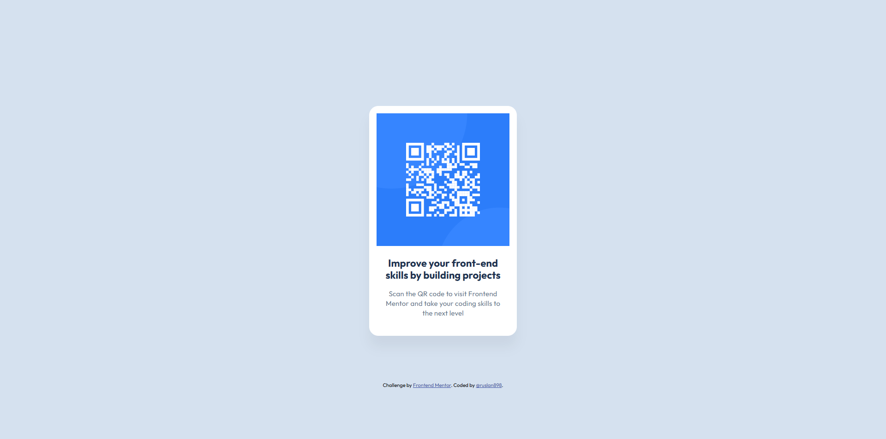

# Frontend Mentor - QR code component solution

This is a solution to the [QR code component challenge on Frontend Mentor](https://www.frontendmentor.io/challenges/qr-code-component-iux_sIO_H). Frontend Mentor challenges help you improve your coding skills by building realistic projects.

## Table of contents

- [Overview](#overview)
  - [Screenshot](#screenshot)
  - [Links](#links)
- [My process](#my-process)
  - [Built with](#built-with)
  - [What I learned](#what-i-learned)
  - [Continued development](#continued-development)
- [Author](#author)

## Overview

### Screenshot



### Links

- Solution URL: [Add solution URL here](https://your-solution-url.com)
- Live Site URL: [Add live site URL here](https://your-live-site-url.com)

## My process

### Built with

- Semantic HTML5 markup
- CSS styling
- CSS custom properties

### What I learned

By building this project, I've learned how to make basic HTML layouts and styling them with CSS using tag and class selectors

To see how you can add code snippets, see below:

```html
<h1 class="title">Improve your front-end skills by building projects</h1>
```
```css
.title {
  color: var(--color-slate-900, rgba(31, 49, 79, 1));
  font-size: 22px;
  font-weight: 700;
  line-height: 120%;
  letter-spacing: 0px;
  text-align: center;
}
```

### Continued development

In future projects I plan on using Flexbox and Grid to better my skills and understanding of this technologies

## Author

- GitHub - [@ruslan898](https://github.com/ruslan898)
- Frontend Mentor - [@ruslan898](https://www.frontendmentor.io/profile/ruslan898)
